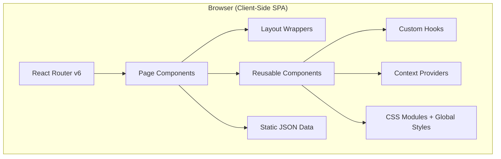

# ARCHITECTURE.md — System Architecture & Folder Structure

---

## 1. High-Level Architecture



This is a **static single-page application (SPA)** — no backend server, no API calls, no database. All content is served from static JSON files bundled at build time.

---

## 2. Complete Folder Structure

```
Project-Zero/
├── public/
│   ├── favicon.ico
│   ├── og-image.jpg              # Open Graph image for social sharing
│   ├── robots.txt
│   └── sitemap.xml
│
├── src/
│   ├── assets/
│   │   ├── images/
│   │   │   ├── hero/             # Hero section backgrounds
│   │   │   ├── services/         # Service-specific imagery
│   │   │   ├── sports/           # Sport category images
│   │   │   ├── portfolio/        # Case study screenshots
│   │   │   ├── team/             # Team member headshots
│   │   │   ├── partners/         # Partner/client logos
│   │   │   └── misc/             # General-purpose images
│   │   ├── icons/                # Custom SVG icons (not covered by react-icons)
│   │   └── videos/               # Hero bg video, promo clips
│   │
│   ├── components/
│   │   ├── common/               # Truly generic, app-agnostic components
│   │   │   ├── Button/
│   │   │   │   ├── Button.jsx
│   │   │   │   ├── Button.module.css
│   │   │   │   └── index.js
│   │   │   ├── Card/
│   │   │   ├── SectionHeading/
│   │   │   ├── Badge/
│   │   │   ├── Skeleton/
│   │   │   ├── ScrollToTop/
│   │   │   ├── Preloader/
│   │   │   └── AnimatedCounter/
│   │   │
│   │   ├── layout/               # Structural / layout components
│   │   │   ├── Navbar/
│   │   │   │   ├── Navbar.jsx
│   │   │   │   ├── Navbar.module.css
│   │   │   │   ├── MegaMenu.jsx
│   │   │   │   ├── MobileDrawer.jsx
│   │   │   │   └── index.js
│   │   │   ├── Footer/
│   │   │   ├── PageHero/
│   │   │   ├── Container/
│   │   │   └── Section/
│   │   │
│   │   ├── home/                 # Home page-specific sections
│   │   │   ├── HeroSection/
│   │   │   ├── ServicesOverview/
│   │   │   ├── AboutSnapshot/
│   │   │   ├── SportsCategories/
│   │   │   ├── PortfolioHighlights/
│   │   │   ├── Testimonials/
│   │   │   ├── CTABanner/
│   │   │   └── PartnersMarquee/
│   │   │
│   │   ├── about/                # About page-specific sections
│   │   │   ├── CompanyStory/
│   │   │   ├── MissionValues/
│   │   │   ├── TeamSection/
│   │   │   └── StatsBar/
│   │   │
│   │   ├── services/             # Service page-specific sections
│   │   │   ├── ServiceHero/
│   │   │   ├── ServiceDescription/
│   │   │   ├── SportExamples/
│   │   │   ├── ProcessSteps/
│   │   │   └── BenefitsGrid/
│   │   │
│   │   ├── portfolio/            # Portfolio page-specific
│   │   │   ├── PortfolioGrid/
│   │   │   ├── FilterBar/
│   │   │   └── CaseStudyCard/
│   │   │
│   │   └── contact/              # Contact page-specific
│   │       ├── ContactForm/
│   │       ├── ContactInfoCards/
│   │       └── MapEmbed/
│   │
│   ├── pages/
│   │   ├── HomePage/
│   │   │   ├── HomePage.jsx
│   │   │   ├── HomePage.module.css
│   │   │   └── index.js
│   │   ├── AboutPage/
│   │   ├── ServicePage/          # Dynamic — renders based on :serviceSlug param
│   │   ├── PortfolioPage/
│   │   ├── ContactPage/
│   │   └── NotFoundPage/
│   │
│   ├── layouts/
│   │   ├── MainLayout.jsx        # Navbar + <Outlet /> + Footer + ScrollToTop
│   │   └── MainLayout.module.css
│   │
│   ├── hooks/
│   │   ├── useScrollPosition.js  # Track scroll Y for navbar transparency
│   │   ├── useInView.js          # Intersection Observer wrapper for scroll reveals
│   │   ├── useMediaQuery.js      # Responsive breakpoint detection
│   │   ├── useAnimatedCounter.js # Counter animation logic
│   │   └── useDocumentTitle.js   # Dynamic <title> per page
│   │
│   ├── context/
│   │   └── SiteConfigContext.jsx  # Global site config (company info, socials, etc.)
│   │
│   ├── data/
│   │   ├── services.json
│   │   ├── sports.json
│   │   ├── portfolio.json
│   │   ├── team.json
│   │   ├── testimonials.json
│   │   ├── partners.json
│   │   ├── siteConfig.json
│   │   └── navigation.json
│   │
│   ├── styles/
│   │   ├── index.css             # Root entry — imports all below
│   │   ├── variables.css         # Design tokens (colors, spacing, fonts, etc.)
│   │   ├── reset.css             # CSS normalize / reset
│   │   ├── typography.css        # Global type styles, font-face declarations
│   │   ├── utilities.css         # Utility classes (.sr-only, .container, etc.)
│   │   └── animations.css        # Global keyframe definitions
│   │
│   ├── utils/
│   │   ├── formatDate.js
│   │   ├── slugify.js
│   │   ├── cn.js                 # className merge helper
│   │   └── constants.js          # App-wide constants (breakpoints, durations, etc.)
│   │
│   ├── App.jsx                   # Root component — wraps providers
│   ├── main.jsx                  # Vite entry point — renders <App />
│   └── router.jsx                # Route definitions + lazy imports
│
├── .eslintrc.cjs
├── .prettierrc
├── .gitignore
├── index.html
├── package.json
├── vite.config.js
├── AGENTS.md
├── PRD.md
├── ARCHITECTURE.md
├── DESIGN_SYSTEM.md
├── PAGES.md
├── COMPONENT_GUIDE.md
├── ANIMATION_GUIDE.md
├── SEO_AND_PERFORMANCE.md
├── API_AND_DATA.md
└── ROUTING.md
```

---

## 3. Module Boundaries & Import Rules

### Dependency Direction (Top → Bottom = Allowed)

```
pages → components → hooks → utils
pages → layouts
pages → data
components → context
components → assets
```

### Forbidden Imports
- ❌ `components/` must NEVER import from `pages/`
- ❌ `hooks/` must NEVER import from `components/` or `pages/`
- ❌ `utils/` must NEVER import from React or any component
- ❌ Sibling page folders must NEVER import from each other
- ❌ `common/` components must NEVER import from page-specific component folders (e.g., `home/`, `about/`)

---

## 4. Build & Dev Configuration

### Vite Config (`vite.config.js`)

```js
import { defineConfig } from 'vite';
import react from '@vitejs/plugin-react';
import path from 'path';

export default defineConfig({
  plugins: [react()],
  resolve: {
    alias: {
      '@': path.resolve(__dirname, './src'),
      '@components': path.resolve(__dirname, './src/components'),
      '@pages': path.resolve(__dirname, './src/pages'),
      '@hooks': path.resolve(__dirname, './src/hooks'),
      '@data': path.resolve(__dirname, './src/data'),
      '@assets': path.resolve(__dirname, './src/assets'),
      '@styles': path.resolve(__dirname, './src/styles'),
      '@utils': path.resolve(__dirname, './src/utils'),
    },
  },
  build: {
    rollupOptions: {
      output: {
        manualChunks: {
          vendor: ['react', 'react-dom', 'react-router-dom'],
          motion: ['framer-motion'],
        },
      },
    },
  },
});
```

### Path Alias Convention
Always use `@` aliases in imports:
```js
// ✅ Good
import { Button } from '@components/common/Button';
import servicesData from '@data/services.json';

// ❌ Bad
import { Button } from '../../../components/common/Button';
```

---

## 5. Lazy Loading Strategy

All page-level components are lazy-loaded to minimize initial bundle size:

```jsx
// router.jsx
import { lazy, Suspense } from 'react';

const HomePage = lazy(() => import('@pages/HomePage'));
const AboutPage = lazy(() => import('@pages/AboutPage'));
const ServicePage = lazy(() => import('@pages/ServicePage'));
const PortfolioPage = lazy(() => import('@pages/PortfolioPage'));
const ContactPage = lazy(() => import('@pages/ContactPage'));
const NotFoundPage = lazy(() => import('@pages/NotFoundPage'));
```

Heavy component-level chunks (e.g., map embed, testimonials carousel) should also be lazy-loaded within their parent pages.

---

## 6. State Management Strategy

| State Type       | Solution                   | Example                                      |
|------------------|----------------------------|----------------------------------------------|
| **UI State**     | `useState` / `useReducer`  | Mobile menu open/closed, active tab           |
| **Derived Data** | Computed in render          | Filtered portfolio items                      |
| **Global Config**| React Context              | Site config (company name, socials, contact)  |
| **URL State**    | React Router params/search | Active sport category, service slug           |
| **Form State**   | `useState` per field       | Contact form inputs                           |

> **Rule:** Do NOT introduce Redux, Zustand, or any external state library. `Context + useReducer` is the ceiling for global state.
