# ROUTING.md — Route Map & Navigation Flow

---

## 1. Route Definitions

All routes are defined in `src/router.jsx` using React Router v6 with lazy-loaded page components.

### Route Table

| Path                         | Component       | Layout        | Lazy | Description                    |
|------------------------------|-----------------|---------------|------|--------------------------------|
| `/`                          | `HomePage`      | `MainLayout`  | ✅   | Landing page — full experience |
| `/about`                     | `AboutPage`     | `MainLayout`  | ✅   | Company story, team, values    |
| `/services/3d-advertising`   | `ServicePage`   | `MainLayout`  | ✅   | 3D Sports Advertising service  |
| `/services/instadia`         | `ServicePage`   | `MainLayout`  | ✅   | Instadia Branding service      |
| `/services/brand-strategy`   | `ServicePage`   | `MainLayout`  | ✅   | Brand Strategy Consulting      |
| `/portfolio`                 | `PortfolioPage` | `MainLayout`  | ✅   | Filterable project grid        |
| `/contact`                   | `ContactPage`   | `MainLayout`  | ✅   | Contact form + info            |
| `*`                          | `NotFoundPage`  | `MainLayout`  | ✅   | 404 error page                 |

---

## 2. Router Implementation

```jsx
// src/router.jsx
import { createBrowserRouter, Navigate } from 'react-router-dom';
import { lazy, Suspense } from 'react';
import MainLayout from '@layouts/MainLayout';
import Preloader from '@components/common/Preloader';

// Lazy-loaded pages
const HomePage = lazy(() => import('@pages/HomePage'));
const AboutPage = lazy(() => import('@pages/AboutPage'));
const ServicePage = lazy(() => import('@pages/ServicePage'));
const PortfolioPage = lazy(() => import('@pages/PortfolioPage'));
const ContactPage = lazy(() => import('@pages/ContactPage'));
const NotFoundPage = lazy(() => import('@pages/NotFoundPage'));

// Suspense wrapper with loading fallback
const SuspenseWrapper = ({ children }) => (
  <Suspense fallback={<Preloader />}>
    {children}
  </Suspense>
);

export const router = createBrowserRouter([
  {
    element: <MainLayout />,
    children: [
      {
        path: '/',
        element: <SuspenseWrapper><HomePage /></SuspenseWrapper>,
      },
      {
        path: '/about',
        element: <SuspenseWrapper><AboutPage /></SuspenseWrapper>,
      },
      {
        path: '/services/:serviceSlug',
        element: <SuspenseWrapper><ServicePage /></SuspenseWrapper>,
      },
      {
        path: '/services',
        element: <Navigate to="/" replace />,  // Redirect bare /services to home
      },
      {
        path: '/portfolio',
        element: <SuspenseWrapper><PortfolioPage /></SuspenseWrapper>,
      },
      {
        path: '/contact',
        element: <SuspenseWrapper><ContactPage /></SuspenseWrapper>,
      },
      {
        path: '*',
        element: <SuspenseWrapper><NotFoundPage /></SuspenseWrapper>,
      },
    ],
  },
]);
```

---

## 3. Dynamic Service Route

The `ServicePage` component uses `useParams()` to read the `:serviceSlug` and load the corresponding service data:

```jsx
// src/pages/ServicePage/ServicePage.jsx
import { useParams, Navigate } from 'react-router-dom';
import services from '@data/services.json';

const ServicePage = () => {
  const { serviceSlug } = useParams();
  const service = services.find(s => s.id === serviceSlug);

  // If slug doesn't match any service, show 404
  if (!service) {
    return <Navigate to="/404" replace />;
  }

  return (
    <>
      <ServiceHero service={service} />
      <ServiceDescription service={service} />
      <SportExamples examples={service.sportExamples} />
      <ProcessSteps steps={service.process} />
      <BenefitsGrid features={service.features} />
      <CTABanner variant="quote" />
    </>
  );
};
```

### Valid Service Slugs

| Slug               | Maps To                      |
|--------------------|------------------------------|
| `3d-advertising`   | 3D Sports Advertising        |
| `instadia`         | Instadia Branding            |
| `brand-strategy`   | Brand Strategy Consulting    |

---

## 4. Navigation Flow Diagram

```mermaid
graph LR
    Home["🏠 Home"] --> About["ℹ️ About"]
    Home --> S1["🎯 3D Advertising"]
    Home --> S2["🏟️ Instadia"]
    Home --> S3["📊 Brand Strategy"]
    Home --> Portfolio["📁 Portfolio"]
    Home --> Contact["📞 Contact"]
    
    About --> Contact
    S1 --> Contact
    S2 --> Contact
    S3 --> Contact
    Portfolio --> Contact
    
    S1 -.-> Portfolio
    S2 -.-> Portfolio
    S3 -.-> Portfolio
```



**Solid lines** = Primary navigation paths (navbar, CTAs)
**Dotted lines** = Secondary paths (contextual links within content)

---

## 5. Scroll Behavior

### Scroll-to-Top on Route Change

Every route change scrolls the page to the top:

```jsx
// In MainLayout.jsx or as a standalone component
import { useEffect } from 'react';
import { useLocation } from 'react-router-dom';

const ScrollToTopOnRouteChange = () => {
  const { pathname } = useLocation();

  useEffect(() => {
    window.scrollTo({ top: 0, behavior: 'instant' });
  }, [pathname]);

  return null;
};
```

### Smooth Scroll for Anchor Links

For in-page navigation (e.g., scrolling to a section on the home page):

```js
const scrollToSection = (sectionId) => {
  const element = document.getElementById(sectionId);
  if (element) {
    element.scrollIntoView({ behavior: 'smooth', block: 'start' });
  }
};
```

---

## 6. Active Link Detection

### Navbar Active States

The navbar highlights the currently active route:

```jsx
import { NavLink } from 'react-router-dom';

<NavLink
  to="/about"
  className={({ isActive }) =>
    isActive ? styles.navLinkActive : styles.navLink
  }
>
  About
</NavLink>
```

**Service pages:** The "Services" nav item should be highlighted when *any* service page is active. Detect this with:

```js
const location = useLocation();
const isServicesActive = location.pathname.startsWith('/services');
```

---

## 7. Breadcrumbs

Inner pages display breadcrumbs in the `PageHero` component:

| Page                     | Breadcrumb Trail                                                |
|--------------------------|-----------------------------------------------------------------|
| About                    | Home → About Us                                                 |
| 3D Sports Advertising    | Home → Services → 3D Sports Advertising                        |
| Instadia Branding        | Home → Services → Instadia Branding                            |
| Brand Strategy Consulting| Home → Services → Brand Strategy Consulting                    |
| Portfolio                | Home → Portfolio                                                |
| Contact                  | Home → Contact                                                  |

### Breadcrumb Data Structure

```js
const breadcrumbs = [
  { label: 'Home', to: '/' },
  { label: 'Services', to: null },  // null = non-clickable parent
  { label: service.title, to: null } // Current page = non-clickable
];
```

---

## 8. Link Guidelines

| Context               | Component to Use         | Example                                   |
|-----------------------|--------------------------|--------------------------------------------|
| Internal navigation   | `<Link to="...">`       | `<Link to="/about">About</Link>`           |
| Nav items             | `<NavLink to="...">`    | Supports `isActive` for styling            |
| External links        | `<a href="..." ...>`    | `<a href="..." target="_blank" rel="noopener noreferrer">` |
| CTA buttons           | `<Button to="...">`     | `<Button to="/contact">Get in Touch</Button>` |
| Programmatic nav      | `useNavigate()`         | `const navigate = useNavigate(); navigate('/contact');` |

> **Rule:** Never use `<a>` tags for internal navigation. Always use React Router's `<Link>` or `<NavLink>`.
